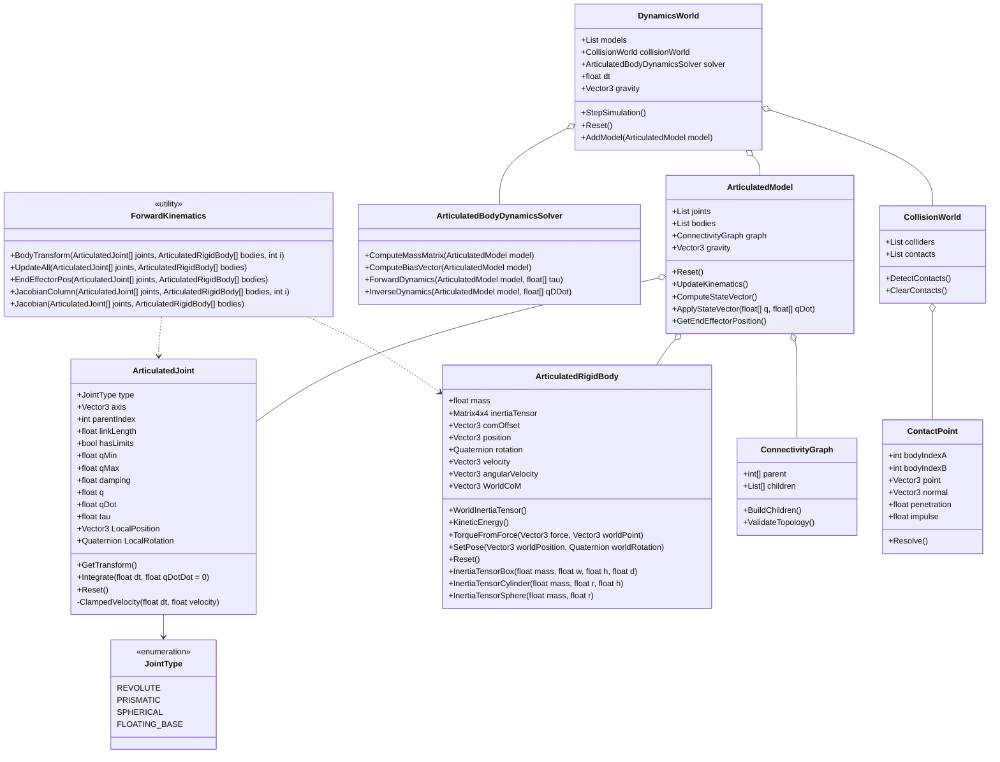

# Physics Simulation: Articulated Body Dynamics

## Lecture Overview

### 1. Introduction

Articulated body dynamics is a modeling methodology originating from robotics. The system consists of rigid bodies connected by joints.

Rigid features between joints are called **bones**, **links**, **segments**, or simply **bodies**.

---

### 2. Examples of Joints

*(Illustrative examples of mechanical joints used in articulated systems)*

---

### 3. Typical Physics Pipeline

A standard simulation pipeline includes:

1. Detect collisions  
2. Generate contact points  
3. Simulate dynamics  

> Note: Joints can also be used to model collisions.

---

### 4. Typical Simulation Code for Articulated Bodies

A typical simulation workflow includes:

1. Create a dynamics world  
2. Create moving objects in the world  
3. Set object states (positions, velocities, etc.)  
4. Create all joints  
5. Assign joints to objects  
6. Set parameters of joints  
7. Create a collision world  
8. Create and set up all contact points  
9. Execute the simulation loop  
10. Reset dynamics and collision worlds  

---

### 5. Computational Robot Dynamics

Computational robot dynamics refers to techniques for simulating the kinematics and dynamics of robots modeled as **tree-like structures** (i.e., without cyclic connections).

These systems consist of rigid bodies whose degrees of freedom are determined by connecting joints.

In 2000, :contentReference[oaicite:0]{index=0} introduced an algorithm to efficiently solve such systems in the context of video games and simulators.

---

### 6. Basic Types of Joints

There are two fundamental joint types:

- **Prismatic joint**: the variable \( q \) represents linear extension  
- **Revolute joint**: the variable \( q \) represents rotation angle  

---

#### Joint Representations

- **Prismatic joint**: \( q \) (extension length)  
- **Revolute joint**: \( q \) (rotation angle)

---

### 7. Spherical Joints

A spherical joint can be represented as two revolute joints \( q_1, q_2 \) with mutually perpendicular axes connected by a zero-length link.

Other joints can be constructed as combinations of these basic joints.

---

### 8. Robot Base

Each robot has a **base (root)**.

A mobile robot is modeled as being attached to the base using a **6-DoF joint**, which represents the maximum degrees of freedom of a rigid body (no constraints).

---

### 9. Connectivity Graph

The robot structure can be represented as a connectivity graph:

- Nodes: bodies  
- Edges: joints  

Example structure:

- base → body 1 → body 2 → body 3 → body 4  

---

### 10. Numbering Bodies and Joints

- Bodies are nodes in the graph  
- Joints are edges  
- The base is node **0**  
- Other nodes are numbered arbitrarily, but each node must have a higher index than its parent  
- Joint \( n \) connects node \( n \) with its parent  

---

### 11. Floating Bases (Mobile Robots)

A **fixed base** is stationary.

A **mobile robot** is connected to the base via a **6-DoF joint**, allowing full motion without constraints. This configuration is called a **floating base**.

---

### 12. Parent Array Representation

A connectivity graph with \( N+1 \) nodes can be represented using a **parent array**:

- The \( n \)-th element stores the parent of node \( n \)  
- The base has no parent (omitted)

Example:
```
h = [0, 1, 1, 3]
```


---

### 13. Configuration Pose

A robot configuration is defined by:

- Joint extension lengths (prismatic joints)
- Joint angles (revolute joints)

Example system with \( N = 6 \):

- 3 prismatic joints  
- 3 revolute joints  
- Fixed link lengths \( l_i \)

---

### 14. State Vector of an Articulated Body

The state vector includes joint positions and velocities:

\[
f(t) =
\begin{bmatrix}
q_1(t) \\
q_2(t) \\
\vdots \\
q_N(t) \\
\dot{q}_1(t) \\
\dot{q}_2(t) \\
\vdots \\
\dot{q}_N(t)
\end{bmatrix}
=
\begin{bmatrix}
q(t) \\
\dot{q}(t)
\end{bmatrix}
\]

where:

\[
q(t) =
\begin{bmatrix}
q_1(t) \\
q_2(t) \\
\vdots \\
q_N(t)
\end{bmatrix}
\]

---

### 15. Articulated Body Dynamics Equation

The system evolves according to:

\[
\frac{df}{dt} =
\begin{bmatrix}
\dot{q} \\
H^{-1}(\tau - C)
\end{bmatrix}
\]

Where:

- \( H \): mass/inertia matrix of size \( N \times N \)  
- \( \tau \): vector of external forces and torques  
- \( C \): vector of Coriolis, centrifugal, and gravitational forces  

---

### 16. Applications in Computer Graphics

Articulated bodies are used to simulate:

- Humans and animals  
- Robots  
- Chains, wires, cables  
- Vegetation such as grass and trees  

---

### 17. Ragdoll Animation

Ragdoll animation (or ragdoll physics) is a technique used to simulate character motion realistically.

Assumptions:

- Minimal or no resisting forces  
- Bodies move inertially like a rag doll  

This technique has been used in games such as:

- :contentReference[oaicite:1]{index=1}  
- :contentReference[oaicite:2]{index=2}  
- :contentReference[oaicite:3]{index=3}  
- :contentReference[oaicite:4]{index=4}  

---

### 18. Inverse vs Forward Dynamics

#### Inverse Dynamics
- Computes forces required to produce given accelerations  
- Used in robotics and increasingly in games  

#### Forward Dynamics
- Computes accelerations from given forces  
- Common in physics engines  

---

### 19. Algorithms

#### Inverse Dynamics
- Newton–Euler algorithm  
- Computational complexity: \( O(n) \)

---

### Forward Dynamics

- Composite-rigid-body algorithm  
  - Optimal for \( n < 9 \)  
  - Complexity: \( O(n^3) \)

- Articulated-body algorithm  
  - Recommended for \( n > 9 \)  
  - Complexity: \( O(n) \)

- Lagrange multiplier method  
  - Recommended for \( n > 9 \)  
  - Complexity: \( O(n) \)

## Class Diagram

