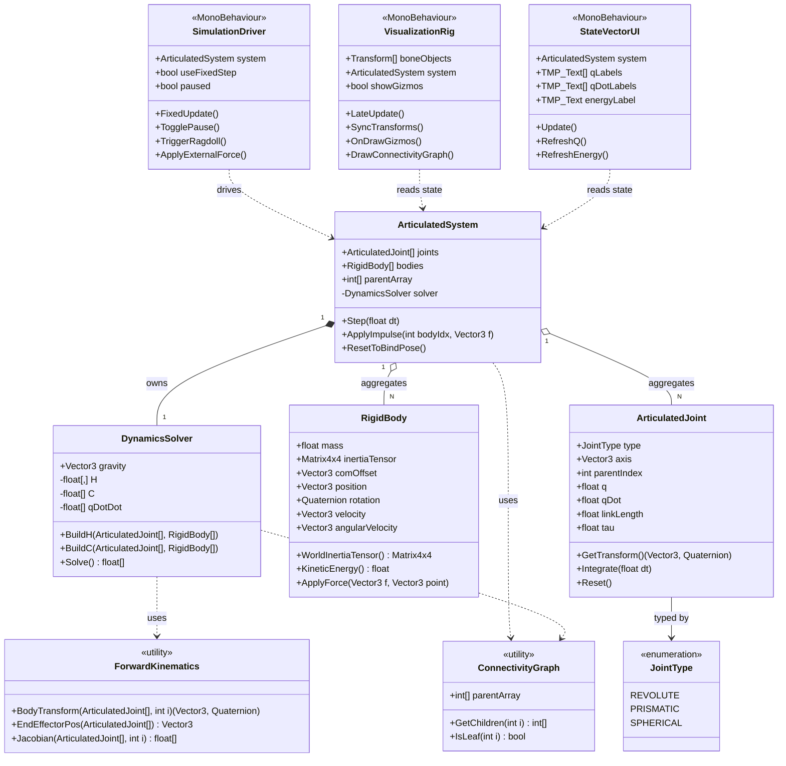

# Physics Simulation: Articulated Body Dynamics

## Class Diagram

```mermaid
classDiagram
 
%% ─── ENUMS ───────────────────────────────────────────────
class JointType {
    <<enumeration>>
    REVOLUTE
    PRISMATIC
    SPHERICAL
}
 
%% ─── CORE DATA ───────────────────────────────────────────
class ArticulatedJoint {
    +JointType type
    +Vector3 axis
    +int parentIndex
    +float q
    +float qDot
    +float linkLength
    +float tau
    +GetTransform() (Vector3, Quaternion)
    +Integrate(float dt)
    +Reset()
}
 
class RigidBody {
    +float mass
    +Matrix4x4 inertiaTensor
    +Vector3 comOffset
    +Vector3 position
    +Quaternion rotation
    +Vector3 velocity
    +Vector3 angularVelocity
    +WorldInertiaTensor() Matrix4x4
    +KineticEnergy() float
    +ApplyForce(Vector3 f, Vector3 point)
}
 
%% ─── SOLVER ──────────────────────────────────────────────
class DynamicsSolver {
    +Vector3 gravity
    -float[,] H
    -float[] C
    -float[] qDotDot
    +BuildH(ArticulatedJoint[], RigidBody[])
    +BuildC(ArticulatedJoint[], RigidBody[])
    +Solve() float[]
}
 
%% ─── UTILITIES ───────────────────────────────────────────
class ForwardKinematics {
    <<utility>>
    +BodyTransform(ArticulatedJoint[], int i) (Vector3, Quaternion)
    +EndEffectorPos(ArticulatedJoint[]) Vector3
    +Jacobian(ArticulatedJoint[], int i) float[]
}
 
class ConnectivityGraph {
    <<utility>>
    +int[] parentArray
    +GetChildren(int i) int[]
    +IsLeaf(int i) bool
}
 
%% ─── ORCHESTRATOR ────────────────────────────────────────
class ArticulatedSystem {
    +ArticulatedJoint[] joints
    +RigidBody[] bodies
    +int[] parentArray
    -DynamicsSolver solver
    +Step(float dt)
    +ApplyImpulse(int bodyIdx, Vector3 f)
    +ResetToBindPose()
}
 
%% ─── MONOBEHAVIOUR LAYER ─────────────────────────────────
class SimulationDriver {
    <<MonoBehaviour>>
    +ArticulatedSystem system
    +bool useFixedStep
    +bool paused
    +FixedUpdate()
    +TogglePause()
    +TriggerRagdoll()
    +ApplyExternalForce()
}
 
class VisualizationRig {
    <<MonoBehaviour>>
    +Transform[] boneObjects
    +ArticulatedSystem system
    +bool showGizmos
    +LateUpdate()
    +SyncTransforms()
    +OnDrawGizmos()
    +DrawConnectivityGraph()
}
 
class StateVectorUI {
    <<MonoBehaviour>>
    +ArticulatedSystem system
    +TMP_Text[] qLabels
    +TMP_Text[] qDotLabels
    +TMP_Text energyLabel
    +Update()
    +RefreshQ()
    +RefreshEnergy()
}
 
%% ─── RELATIONSHIPS ───────────────────────────────────────
 
%% ArticulatedSystem owns / aggregates
ArticulatedSystem "1" *-- "1" DynamicsSolver : owns
ArticulatedSystem "1" o-- "N" ArticulatedJoint : aggregates
ArticulatedSystem "1" o-- "N" RigidBody : aggregates
ArticulatedSystem ..> ConnectivityGraph : uses
 
%% Joint uses enum
ArticulatedJoint --> JointType : typed by
 
%% Solver uses utilities
DynamicsSolver ..> ForwardKinematics : uses
DynamicsSolver ..> ConnectivityGraph : uses
 
%% MonoBehaviour layer depends on system
SimulationDriver ..> ArticulatedSystem : drives
VisualizationRig ..> ArticulatedSystem : reads state
StateVectorUI ..> ArticulatedSystem : reads state
```
